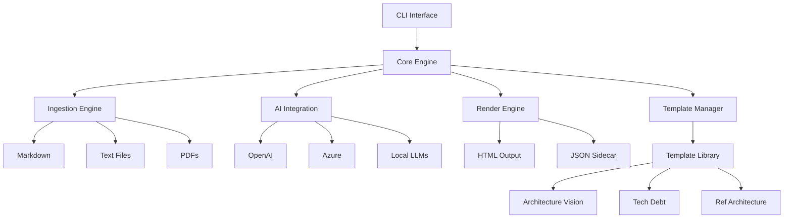

# DocLoom

<div align="center">


**Beautiful, template-driven technical documentation — fast.**

[Quick Start](#quick-start) • [Features](#features) • [Documentation](#documentation) • [Templates](#available-templates) • [Contributing](#contributing)

</div>

---

## ✨ What is DocLoom?

DocLoom is a powerful documentation generator that transforms your scattered technical materials into professional, branded documents. By combining structured templates with AI assistance, it produces consistent, high-quality documentation that's ready to print, share, and iterate.

### 🎯 Key Features

- **🎨 Professional Templates** - Pre-built templates for architecture visions, technical debt summaries, and reference architectures
- **🤖 AI-Powered Generation** - Intelligent content generation using OpenAI, Azure, Claude, or local LLMs
- **📚 Multi-Source Processing** - Ingest Markdown, text files, PDFs, and other documents as source material
- **🔍 Smart Content Assembly** - Automatically extracts and organizes relevant information from your sources
- **📊 Structured Output** - Generates beautiful HTML with embedded styles and JSON sidecars for traceability
- **🔧 Flexible Configuration** - YAML configs, environment variables, and CLI flags for complete control
- **🚀 Production Ready** - Battle-tested with comprehensive test coverage and CI/CD pipeline
- **🐳 Docker Support** - Run anywhere with our official Docker images

## 🚀 Quick Start

Get up and running in 30 seconds:

```bash
# Install via Go
go install github.com/karolswdev/docloom/cmd/docloom@latest

# Or download the latest binary
curl -L https://github.com/karolswdev/docloom/releases/latest/download/docloom_$(uname -s)_$(uname -m).tar.gz | tar xz
sudo mv docloom /usr/local/bin/

# Generate your first document
export OPENAI_API_KEY="your-api-key"
docloom generate --type architecture-vision --source ./docs --out my-vision.html

# Open the result
open my-vision.html  # macOS
# xdg-open my-vision.html  # Linux
# start my-vision.html  # Windows
```

That's it! You've just created a professional architecture vision document.

## 📖 Table of Contents

- [Installation](#installation)
  - [Binary Releases](#binary-releases)
  - [Docker](#docker)
  - [From Source](#from-source)
- [Usage](#usage)
  - [Basic Commands](#basic-commands)
  - [Generating Documents](#generating-documents)
  - [Dry Run Mode](#dry-run-mode)
- [Configuration](#configuration)
  - [Config File](#configuration-file)
  - [Environment Variables](#environment-variables)
  - [AI Providers](#supported-ai-providers)
- [Templates](#available-templates)
- [Architecture](#architecture)
- [Development](#development)
- [Contributing](#contributing)
- [License](#license)

## 📦 Installation

### Binary Releases

Download pre-built binaries for your platform from our [GitHub Releases](https://github.com/karolswdev/docloom/releases).

#### Linux/macOS

```bash
# Download the latest release (replace VERSION and PLATFORM)
VERSION=$(curl -s https://api.github.com/repos/karolswdev/docloom/releases/latest | grep tag_name | cut -d '"' -f 4)
PLATFORM=$(uname -s)_$(uname -m)
curl -L "https://github.com/karolswdev/docloom/releases/download/${VERSION}/docloom_${PLATFORM}.tar.gz" | tar xz

# Move to PATH
sudo mv docloom /usr/local/bin/

# Verify installation
docloom --version
```

#### Windows

Download the `.zip` file from the [releases page](https://github.com/karolswdev/docloom/releases), extract it, and add to your PATH.

### Docker

```bash
# Pull the latest image
docker pull ghcr.io/karolswdev/docloom:latest

# Run with your local files
docker run --rm \
  -v $(pwd):/workspace \
  -e OPENAI_API_KEY="$OPENAI_API_KEY" \
  ghcr.io/karolswdev/docloom:latest generate \
  --type architecture-vision \
  --source /workspace/docs \
  --out /workspace/output.html
```

### From Source

Requires Go 1.22 or later:

```bash
# Clone and build
git clone https://github.com/karolswdev/docloom.git
cd docloom
make build

# Install to $GOPATH/bin
make install

# Or use go install directly
go install github.com/karolswdev/docloom/cmd/docloom@latest
```

## 🔧 Usage

### Basic Commands

```bash
# Show help and available commands
docloom --help

# Display version information
docloom version

# List available templates
docloom templates list

# Show detailed template information
docloom templates describe architecture-vision
```

### Generating Documents

```bash
# Basic generation with environment variable API key
export OPENAI_API_KEY="your-api-key"
docloom generate \
  --type architecture-vision \
  --source ./project-docs \
  --out architecture.html

# Using multiple source directories
docloom generate \
  --type technical-debt-summary \
  --source ./docs --source ./issues --source ./notes.md \
  --out debt-report.html

# With specific model and temperature
docloom generate \
  --type reference-architecture \
  --source ./specs \
  --model gpt-4 \
  --temperature 0.3 \
  --out reference.html
```

### Dry Run Mode

Preview what DocLoom will do without making API calls:

```bash
# See the assembled prompt and selected source chunks
docloom generate \
  --type architecture-vision \
  --source ./docs \
  --out output.html \
  --dry-run

# Combine with verbose mode for maximum detail
docloom generate \
  --type architecture-vision \
  --source ./docs \
  --out output.html \
  --dry-run \
  --verbose
```

### Advanced Usage

```bash
# Force overwrite existing files
docloom generate \
  --type architecture-vision \
  --source ./docs \
  --out output.html \
  --force

# Using Azure OpenAI
docloom generate \
  --type architecture-vision \
  --source ./docs \
  --model gpt-35-turbo \
  --base-url https://myinstance.openai.azure.com \
  --api-key "azure-key" \
  --out output.html

# Using local LLM (Ollama, LocalAI, etc.)
docloom generate \
  --type architecture-vision \
  --source ./docs \
  --model llama2 \
  --base-url http://localhost:11434/v1 \
  --api-key "unused" \
  --out output.html

# With configuration file
docloom generate \
  --config ./docloom.yaml \
  --type architecture-vision \
  --source ./docs \
  --out output.html
```

## ⚙️ Configuration

DocLoom supports flexible configuration through multiple sources (in precedence order):

1. **CLI flags** - Direct command-line arguments
2. **Environment variables** - `DOCLOOM_` prefixed variables
3. **Configuration file** - YAML configuration
4. **Defaults** - Built-in sensible defaults

### Configuration File

Create a `docloom.yaml`:

```yaml
# Model configuration
model: gpt-4
base_url: https://api.openai.com/v1
temperature: 0.7
max_retries: 3

# Template configuration  
template_dir: ./custom-templates

# Output configuration
force: false

# Operational configuration
verbose: false
dry_run: false
```

Use with: `docloom generate --config docloom.yaml ...`

### Environment Variables

| Variable | Description | Default |
|----------|-------------|---------|
| `OPENAI_API_KEY` | OpenAI API key (required) | - |
| `DOCLOOM_MODEL` | AI model to use | `gpt-4` |
| `DOCLOOM_BASE_URL` | API endpoint URL | `https://api.openai.com/v1` |
| `DOCLOOM_TEMPERATURE` | Generation temperature (0.0-1.0) | `0.7` |
| `DOCLOOM_TEMPLATE_DIR` | Custom templates directory | - |
| `DOCLOOM_VERBOSE` | Enable verbose logging | `false` |
| `DOCLOOM_DRY_RUN` | Preview without API calls | `false` |

### Supported AI Providers

DocLoom works with any OpenAI-compatible API:

- **OpenAI** - GPT-4, GPT-3.5-Turbo, etc.
- **Azure OpenAI** - Your Azure deployments
- **Anthropic Claude** - Via proxy
- **Google Gemini** - Via proxy
- **Local LLMs** - Ollama, LocalAI, llama.cpp
- **Custom Deployments** - Any OpenAI-compatible endpoint

## 📄 Available Templates

DocLoom ships with professional templates for common documentation needs:

### Architecture Vision
Document high-level system architecture and strategic direction:
- Executive summary
- System context and boundaries
- Key architectural decisions
- Technology stack
- Integration points

### Technical Debt Summary
Track and prioritize technical improvements:
- Debt inventory
- Impact assessment
- Remediation strategies
- Priority matrix
- Timeline estimates

### Reference Architecture
Define standard patterns and practices:
- Component specifications
- Design patterns
- Best practices
- Implementation guidelines
- Code examples

## 🏗️ Architecture



### Core Components

- **CLI Interface** - Cobra-based command structure with comprehensive flags
- **Template Manager** - Loads and validates document templates with field schemas
- **Ingestion Engine** - Processes multiple source formats into unified content
- **AI Integration** - Flexible provider system supporting any OpenAI-compatible API
- **Render Engine** - Generates styled HTML and JSON output with full traceability

## 💻 Development

### Prerequisites

- Go 1.22 or later
- Make (optional but recommended)
- golangci-lint (for linting)

### Building

```bash
# Clone the repository
git clone https://github.com/karolswdev/docloom.git
cd docloom

# Run tests
make test

# Run linting
make lint

# Build binary
make build

# Run all CI checks
make ci
```

### Project Structure

```
docloom/
├── cmd/docloom/          # CLI entry point
├── internal/             # Core implementation
│   ├── ai/              # AI provider integration
│   ├── config/          # Configuration management
│   ├── ingest/          # Source file processing
│   ├── render/          # Output generation
│   └── templates/       # Template management
├── pkg/                 # Public packages
├── templates/           # Built-in templates
├── docs/               # Documentation
│   └── SRS.md         # Software Requirements Spec
└── tests/              # Test fixtures and data
```

### Testing

```bash
# Run all tests with race detection
make test

# Run with coverage
make coverage

# Run specific tests
go test -v ./internal/ai/...

# Run integration tests
make integration-test
```

## 🤝 Contributing

We welcome contributions! DocLoom follows industry-standard practices to ensure code quality and maintainability.

### Getting Started

1. Read our [Software Requirements Specification](docs/SRS.md) to understand the project scope
2. Check the [Issues](https://github.com/karolswdev/docloom/issues) for good first contributions
3. Fork the repository and create a feature branch
4. Make your changes following our standards
5. Submit a PR with a clear description

### Code Standards

- **Commit Messages** - We use [Conventional Commits](https://www.conventionalcommits.org/):
  - `feat:` New features
  - `fix:` Bug fixes
  - `docs:` Documentation changes
  - `test:` Test additions or changes
  - `refactor:` Code refactoring
  - `chore:` Maintenance tasks

- **Code Quality** - All code must pass:
  ```bash
  make lint  # golangci-lint checks
  make test  # Unit tests with race detection
  make ci    # All quality checks
  ```

- **Testing** - Write tests for new functionality, especially on critical paths

### Development Workflow

1. Fork and clone the repository
2. Create a feature branch from `main`
3. Make your changes with appropriate tests
4. Run `make ci` to ensure quality
5. Push your branch and create a PR
6. Address review feedback

### Reporting Issues

Found a bug or have a feature request? [Open an issue](https://github.com/karolswdev/docloom/issues/new) with:
- Clear description of the problem or request
- Steps to reproduce (for bugs)
- Expected vs actual behavior
- Your environment details

## 📚 Documentation

- [Software Requirements Specification](docs/SRS.md) - Detailed project requirements
- [API Reference](https://pkg.go.dev/github.com/karolswdev/docloom) - Go package documentation
- [Template Development Guide](docs/templates.md) - Creating custom templates
- [Architecture Decision Records](docs/adr/) - Key design decisions

## 🔒 Security

### Security Policy

We take security seriously. If you discover a vulnerability:

1. **Do not** open a public issue
2. Email security concerns to the maintainers
3. Allow time for a fix before public disclosure

### API Key Safety

- API keys are never logged or included in output files
- Automatic redaction in debug output
- Support for environment variables and secure config files

## 📜 License

DocLoom is open source software. See the [LICENSE](LICENSE) file for details.

## 🙏 Acknowledgments

DocLoom stands on the shoulders of giants:

- [Cobra](https://github.com/spf13/cobra) for CLI framework
- [Zerolog](https://github.com/rs/zerolog) for structured logging
- [OpenAI Go](https://github.com/sashabaranov/go-openai) for AI integration
- The Go community for excellent tools and libraries

Special thanks to all [contributors](https://github.com/karolswdev/docloom/graphs/contributors) who help make DocLoom better!

## 🗺️ Roadmap

### Current Focus (v1.x)
- ✅ Core template engine
- ✅ Multi-source ingestion
- ✅ AI integration
- ✅ Docker support
- ✅ Comprehensive testing

### Coming Soon (v2.0)
- 🔄 Web UI for template editing
- 🔄 Template marketplace
- 🔄 Real-time collaboration
- 🔄 Version control integration
- 🔄 Custom field validators

### Future Vision
- 📋 API server mode
- 📋 Plugin system
- 📋 Multi-language support
- 📋 Advanced analytics
- 📋 Enterprise features

---

<div align="center">

**Ready to create beautiful documentation?**

[Get Started](#quick-start) • [Read the Docs](#documentation) • [Join the Community](https://github.com/karolswdev/docloom/discussions)

Made with ❤️ by the DocLoom team

</div>