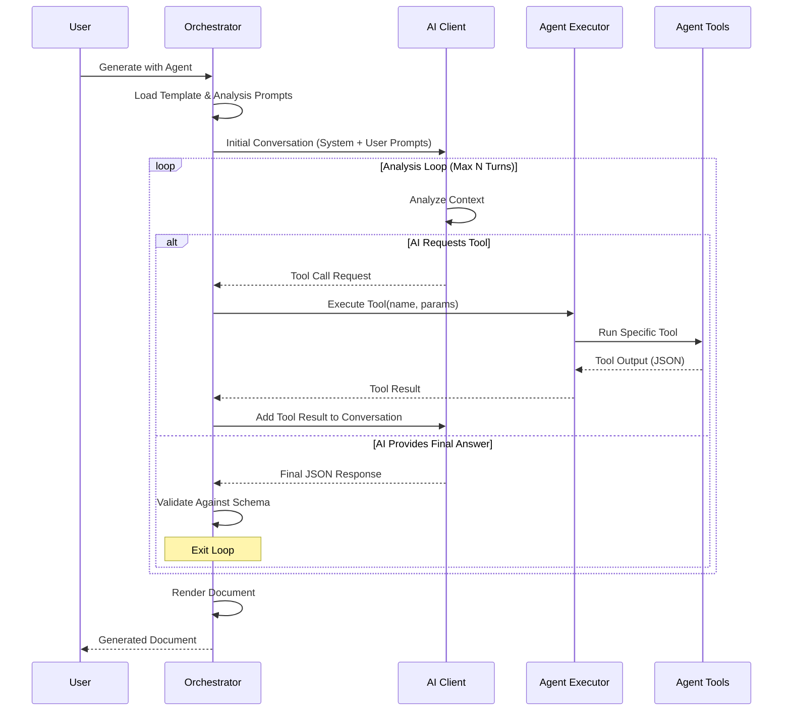

# AI-Orchestrated Analysis Loop Architecture

## Overview

The Analysis Loop is a sophisticated multi-turn conversation system that enables DocLoom to leverage AI-driven exploration of codebases through agent tools. This architecture allows the AI to autonomously direct research agents to gather information, analyze code, and synthesize comprehensive documentation.

## Core Components

### 1. AI Client with Tool Calling

The enhanced AI client (`internal/ai/tools.go`) provides:
- **Tool Definition**: Structured representation of agent capabilities
- **Tool Calling**: AI can request execution of specific tools
- **Conversation Management**: Maintains context across multiple turns
- **Response Handling**: Processes both tool calls and final responses

### 2. Agent Tool System

Agents expose discrete tools (`internal/agent/types.go`):
- **Tool Registry**: Each agent defines multiple tools with descriptions
- **Tool Executor**: Executes specific tools with parameters
- **Result Formatting**: Returns structured JSON for AI consumption

### 3. Analysis Orchestrator

The orchestrator (`internal/generate/analysis.go`) coordinates:
- **Loop Management**: Controls the multi-turn conversation flow
- **Tool Invocation**: Executes tools requested by the AI
- **Context Building**: Maintains conversation history
- **Termination Logic**: Determines when analysis is complete

### 4. Template-Driven Intelligence

Templates (`internal/templates/registry.go`) provide:
- **System Prompts**: Define the AI's role and capabilities
- **Initial Prompts**: Set the analysis objectives
- **Schema Validation**: Ensure output matches expected format

## Workflow Sequence



## Implementation Details

### Tool Definition Format

```go
type Tool struct {
    Name        string `json:"name"`
    Description string `json:"description"`
    Parameters  any    `json:"parameters"`
}
```

Tools are converted from agent definitions to AI-compatible format:
- Name becomes the tool identifier
- Description guides AI on when/how to use the tool
- Parameters define expected inputs

### Conversation Message Types

```go
type ChatMessage struct {
    Role       string     // "system", "user", "assistant", "tool"
    Content    string     // Message content
    ToolCalls  []ToolCall // For assistant tool requests
    ToolCallID string     // For tool responses
}
```

### Analysis Options

```go
type AnalysisOptions struct {
    AgentName    string              // Agent to use
    Template     *templates.Template // Template with prompts
    SourcePath   string              // Repository path
    MaxTurns     int                 // Loop limit
    AgentParams  map[string]string   // Additional parameters
}
```

## Key Features

### 1. Autonomous Exploration

The AI can:
- Discover repository structure
- Identify key files and components
- Follow dependencies and relationships
- Build comprehensive understanding

### 2. Tool Chaining

Tools can be designed to work together:
```yaml
tools:
  - name: list_projects
    description: "Lists all projects. Use first to understand structure."
  
  - name: analyze_project
    description: "Analyzes specific project. Call after list_projects."
  
  - name: get_dependencies
    description: "Gets project dependencies. Requires project path from analyze_project."
```

### 3. Error Resilience

The system handles failures gracefully:
- Tool execution errors are reported to AI
- AI can adapt strategy based on failures
- Analysis continues despite individual tool failures

### 4. Context Preservation

Full conversation history is maintained:
- Previous tool results inform future requests
- AI builds cumulative understanding
- Context enables sophisticated analysis

## Configuration

### Template Analysis Section

```yaml
analysis:
  system_prompt: |
    You are an expert code analyst. Use the available tools to explore
    and understand the repository structure, then generate comprehensive
    documentation according to the template schema.
  
  initial_user_prompt: |
    Please analyze this repository thoroughly. Start by understanding
    the overall structure, then dive into specific components as needed.
```

### Agent Tool Descriptions

```yaml
tools:
  - name: get_api_surface
    description: |
      Extracts the public API surface of the codebase.
      Returns: JSON with namespaces, classes, methods, and properties.
      Use when: You need to understand the code's public interface.
      Prerequisites: Call list_projects first to identify targets.
```

## Performance Considerations

### Turn Limits

- Default: 10 turns maximum
- Configurable per template
- Prevents infinite loops
- Balances thoroughness with efficiency

### Token Management

- Tool outputs are included in context
- Large outputs may consume significant tokens
- Tools should return concise, relevant data
- Pagination or filtering may be necessary

### Caching Strategy

- Agent executor caches tool outputs
- Repeated tool calls return cached results
- Cache invalidation based on parameters
- Reduces redundant processing

## Security Considerations

### Tool Execution

- Tools run in controlled environment
- Parameters are validated before execution
- Output is sanitized before returning
- Resource limits prevent abuse

### Information Disclosure

- Tools should not expose sensitive data
- File paths are relative when possible
- Credentials are never included in output
- Access controls respect system permissions

## Testing Strategy

### Unit Tests

- Mock AI client for controlled responses
- Mock agent executor for tool simulation
- Verify conversation flow and state management
- Test error handling and edge cases

### Integration Tests

- Real agent tools with test repositories
- Actual AI client with test API
- End-to-end document generation
- Performance and timeout validation

## Future Enhancements

### Planned Improvements

1. **Parallel Tool Execution**: Run independent tools simultaneously
2. **Tool Result Caching**: Persistent cache across sessions
3. **Streaming Responses**: Real-time progress updates
4. **Custom Tool Protocols**: Support for different tool interfaces

### Extensibility Points

1. **Custom Message Types**: Additional conversation elements
2. **Tool Middleware**: Pre/post-processing hooks
3. **Analysis Strategies**: Template-specific analysis patterns
4. **Result Transformers**: Custom output formatting

## Usage Examples

### Basic Analysis

```go
opts := AnalysisOptions{
    AgentName:  "csharp-analyzer",
    Template:   template,
    SourcePath: "/path/to/repo",
    MaxTurns:   10,
}

result, err := orchestrator.runAnalysisLoop(ctx, opts)
```

### With Parameters

```go
opts := AnalysisOptions{
    AgentName:  "security-scanner",
    Template:   securityTemplate,
    SourcePath: "/path/to/repo",
    MaxTurns:   15,
    AgentParams: map[string]string{
        "scan_depth": "deep",
        "include_deps": "true",
    },
}
```

## Troubleshooting

### Common Issues

1. **Tool Not Found**: Verify agent definition includes the tool
2. **Invalid Tool Output**: Ensure tools return valid JSON
3. **Conversation Timeout**: Increase MaxTurns or optimize tools
4. **Schema Validation Failure**: Check AI response format

### Debug Logging

Enable verbose logging to trace:
- Tool invocation details
- Conversation messages
- AI responses
- Validation results

```bash
DOCLOOM_LOG_LEVEL=debug docloom generate --agent analyzer --verbose
```

## Conclusion

The AI-Orchestrated Analysis Loop represents a paradigm shift in automated documentation generation. By combining AI's reasoning capabilities with specialized agent tools, DocLoom can autonomously explore and understand complex codebases, producing comprehensive and accurate technical documentation with minimal human intervention.